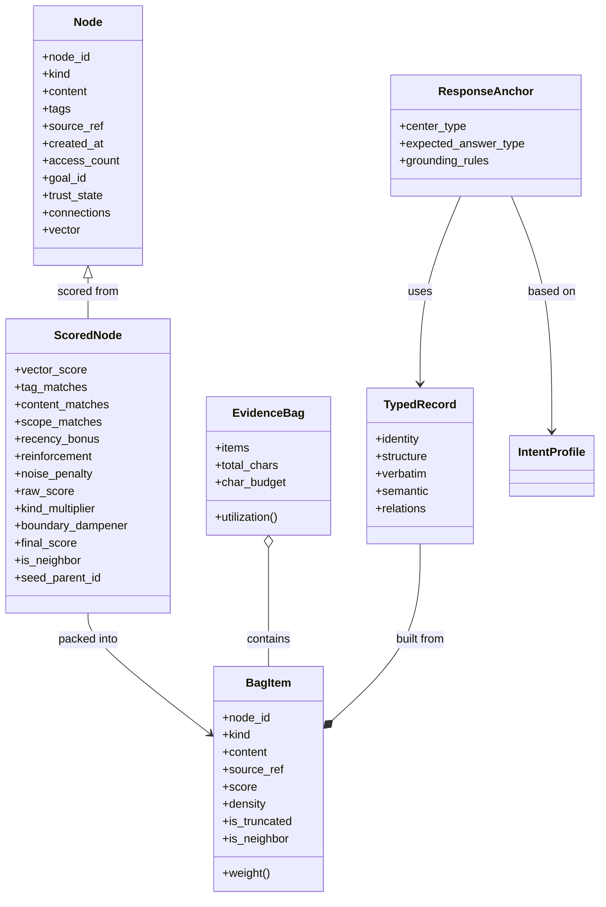

# Legacy Note

This document is historical context from an older bag-of-evidence line.

It is **not** the active architecture truth for the current project.
Use these as the live truth surfaces first:
- `_docs/ARCHITECTURE.md`
- `_docs/WE_ARE_HERE_NOW.md`
- `_docs/TODO.md`
- `_docs/_research/2026-03-31_scope_root_bag_slice_and_two_sided_anchoring.md`

Read this file as legacy/reference material only.

# Executive Summary

The *bag-of-evidence interrogation stack* is a layered pipeline that transforms a user query into a structured context drawn from a codebase or knowledge base. It combines two main phases: (A) **evidence bag assembly** and (B) **context interrogation formatting**. In phase (A), relevant information (“nodes”) from a stored repository is **retrieved, scored, expanded, and composed** into an *EvidenceBag* under a fixed character budget. In phase (B), this bag’s contents are further processed to produce a detailed, human-readable context for answering the query. This involves classifying the query’s intent (e.g. “identity” vs “explanation”), extracting structured records from each evidence item, applying grounding rules, and finally formatting the evidence into a prompt block. 

This report documents the entire stack: the involved files, the step-by-step workflow, data models and mathematics (e.g. scoring formulas, density calculations), algorithms with pseudocode, prompts/APIs, and validation tests. It also provides guidance on using and extending the system, including usage examples, trust considerations (e.g. distinguishing canonical vs. agent-generated content), and a checklist for migrating or adapting the stack. Tables and Mermaid diagrams illustrate file organization, processing stages, and entity relationships. 

# File Map

The **evidence bag interrogation** functionality spans source code, tests, and design docs. Key files and their purposes are:

| Path                                    | Type      | Purpose                                                      |
|-----------------------------------------|-----------|--------------------------------------------------------------|
| `src/core/bag_interrogation.py`         | Source    | Implements the query intent classification and formatting pipeline, including functions `classify_intent`, `build_typed_records`, `build_response_anchor`, and `format_interrogated_context`. |
| `src/core/evidence_bag_adapter.py`      | Source    | Bridges the knowledge base and the evidence bag system. Syncs data from the app’s KB into the evidence store and provides `search_with_evidence(query)`, returning an assembled `EvidenceBag`. |
| `evidence_bag/composition.py`           | Source    | Defines `EvidenceBag`, `BagItem`, and the **BagComposer**. Handles category-based budgeting and density-packing to build the final evidence bag (packing candidates under the char budget). |
| `evidence_bag/config.py`                | Source    | Configuration parameters (`CompositionConfig`), including scoring weights, packing settings (ratios, budgets, policies), and thresholds. |
| `evidence_bag/node.py`                  | Source    | Defines the `Node` (raw information unit) and `ScoredNode` (with query-derived scores) data classes, plus enums `NodeKind` and `TrustState`. |
| `evidence_bag/redundancy.py`            | Source    | Implements redundancy suppression, computing penalties for overlapping content or tags (`compute_redundancy_penalties`). |
| `evidence_bag/runtime.py`               | Source    | The top-level `EvidenceBagRuntime` managing the full **retrieve → score → expand → compose** pipeline. Uses `GravityScorer` for scoring and `BagComposer` for composition. |
| `tests/test_bag_interrogation.py`       | Test      | Unit tests for the interrogation stack: checks intent classification, record extraction, response anchoring, and final formatting logic against expected outputs. |
| `tests/test_evidence_bag.py`            | Test      | Unit tests for the evidence bag system: tokenizer, store CRUD, scoring math, composition/packing, and full pipeline. Verifies scoring formulas, neighbor expansion, packing behavior, etc. |
| `_docs/Evidence_Bag_and_Memory_Scoring.md` | Doc    | Design notes on how vector similarity and the gravity scoring formula work. Defines cosine similarity, scoring weights, recency bonus, reinforcement, and multipliers. |
| `_docs/evidence_bag_composition_and_tuning.md` | Doc | Design notes on evidence bag composition: budgets, packing strategy, redundancy rules, oversize handling. (References category ratios and budget policies.) |
| `_docs/evidence_bag_runtime_policy.md`  | Doc    | Runtime policy decisions (e.g. packing strategy, thresholds). Outlines overall flow and parameter choices. |
| `_docs/other_*.md`                     | Doc    | Other dev logs and architecture docs (see DEVLOG.md, NORTHSTAR.md, etc.), which may touch on high-level goals but do not contain core code. |

Each of the **Source** files above implements a specific layer of the stack. The **Test** files verify behavior of those layers. The **Doc** files explain the design and math behind the components (e.g. scoring formulas, tuning of parameters). 

# Interrogation Workflow

The interrogation process involves two integrated pipelines. First, **assemble an EvidenceBag** for the query; second, **format the bag into an answer context**. The following table outlines each stage with inputs, outputs, and key conditions:

| **Stage**                        | **Input**                                     | **Process/Logic**                                                                                              | **Output**                                  | **Preconditions / Notes**                                                              |
|----------------------------------|-----------------------------------------------|----------------------------------------------------------------------------------------------------------------|---------------------------------------------|-----------------------------------------------------------------------------------------|
| **(A1) KB Sync**                | KnowledgeBase chunks (code, text)             | *Sync from KB:* Extract all code/text chunks and curated summaries from the application’s database. Build `Node` objects (kind, content, tags, source_ref, vector embedding, etc.). Insert or update these into the evidence bag’s SQLite store. (Ensures `EvidenceBagRuntime` has all data.) | Nodes stored (IDs assigned)                | Needs database connection. Called once or on-demand before search.                       |
| **(A2) Query Embedding**         | User query text                               | *Embed query:* If a query vector is not provided, obtain one via a loaded model (e.g. call model.encode).       | Query embedding vector (float list)         | Requires a loaded embedding model or skip vector similarity if none.                    |
| **(A3) Retrieve & Score All**    | All nodes, query text/vector, active goal id  | *Gravity scoring:* For each node: compute cosine similarity (clamped ≥0), token overlaps (tag/content/scope), recency bonus, reinforcement (log access_count), noise penalties (tags/content issues). Sum into `raw_score = w·vector + w_tag·tag + w_cont·content + w_scope·scope + recency + reinforcement – noise`. Apply kind multiplier and goal-boundary dampener: `final_score = raw_score * kind_mult * boundary_mult`. | List of `ScoredNode`, sorted by final_score descending | If no nodes, pipeline ends with empty bag. Boundary dampener = 0.1 for cross-goal ANSWER nodes. |
| **(A4) Seed Selection**          | Scored list                                   | *Seed pool:* Take the top `top_seed_count` (default 5) nodes as seeds.                                           | Seeds list (ScoredNode)                    | Default config has `top_seed_count=5`.                                                   |
| **(A5) Neighbor Expansion**      | Seeds, node connections                       | For each seed (with node_id): fetch connected neighbors (via edges in store). Score each neighbor similarly to seeds. Propagate seed’s score: `neighbor.final_score = β * seed_score` (β = 0.3). Mark `is_neighbor=True`, set `seed_parent_id`. Keep only neighbors with `final_score ≥ neighbor_threshold` (default 5.0). | Neighbor scored list (ScoredNode)           | Must not exceed final candidate cap later.                                               |
| **(A6) Candidate Pool Assembly** | Initial scored list, neighbors                | *Combine:* Append neighbor candidates to the original scored list. Sort all by final_score, descending. Truncate to `final_candidate_pool_cap` (default 64). | Final candidate pool (ScoredNode)           | Ensures a bounded list of high-score candidates.                                         |
| **(A7) Bag Composition**         | Final candidate pool                          | *BagComposer:*  <ul><li>**Categorize:** Assign each candidate to a category: `"neighbor"` if is_neighbor, else its `node.kind` (goal/memory/knowledge; default to knowledge).</li><li>**Budgeting:** Allocate character budgets for each category by fixed ratios (goal:25%, memory:30%, knowledge:35%, neighbor:10% of total char_budget, default 4000). </li><li>**Pack Each Category:** Within each category, rank candidates by **density** (see below) and greedily pack in descending order until the category’s char budget is filled or candidates exhausted. If an item doesn’t fully fit, apply oversize policy: either drop, truncate, or focus-extract a chunk. Keep track of any unused category budget and leftover candidates.</li><li>**Spillover:** Use any remaining global budget to pack leftover candidates from all categories (also by density) until budget runs out.</li><li>**Finalize Bag:** Construct an `EvidenceBag` object containing the selected `BagItem`s, total_chars used, and metadata (config values). Each `BagItem` includes its content, score, density, source reference, and flags.</li></ul>  | Completed `EvidenceBag` (items + metadata) | See **Data/Math** below for formulas. Total chars ≤ char_budget. Redundancy penalties reduce density as needed. |
| **(B1) Intent Classification**  | Query text, mode (TaskMode, scope)           | *classify_intent:* Map the query to an `IntentProfile` (intent class and prioritized dimensions). If mode=CLASSIFY/LABEL → IDENTITY, PATCH/COMMIT_DRAFT → VERBATIM_EXPLANATION, QUERY_REWRITE → RELEVANCE, else use keyword matching. Keyword sets detect “identity” (e.g. “which class”), “structure” (“where is”), “definition”, “relevance”, “dependency”, “design” questions. Fallback: if query starts with “what does/explain/how”, return VERBATIM_EXPLANATION, otherwise GENERAL. | `IntentProfile` (intent class, answer type, dimension list) | Critical for grounding rules. Produces primary dimension focus. |
| **(B2) Record Extraction**      | `EvidenceBag.items`, intent profile          | For each `BagItem`, build a `TypedRecord` with components: <ul><li>**IdentityRecord:** `node_id`, `object_name` (from tags), `object_type` (kind), canonical `source_ref` path, file extension.</li><li>**StructureRecord:** `parent_package` (from path), `hierarchy_depth` (path depth), `container_hint` (if object_name in path).</li><li>**VerbatimRecord:** full `content`, `line_count`, and the first significant code line as a header.</li><li>**SemanticRecord:** carrying the `score`, `density` (score/weight), `is_neighbor`, and a match reason. Rules: if neighbor → label “neighbor expansion”; if score>0.5 → “strong match”; 0.2–0.5 → “moderate match”; ≤0.2 → “weak match”.</li><li>**RelationRecord:** flags if neighbor (with `neighbor_source` seed id) and connection count (unused here). </li></ul>  | List of `TypedRecord` (one per BagItem)  | StructureRecord only added if intent includes structural dimension. Semantic/relations added if intent is semantic. Verbose flags if needed. |
| **(B3) Response Anchoring**     | `IntentProfile`, typed records              | *build_response_anchor:* Determine the **center** (focus dimension) from intent, and list of **grounding rules**. Center types come from intent class (`identity`, `structure`, `semantic`, or `relational`). Grounding rules are predefined per intent (e.g. “reference code lines for explanations”). Also add a universal rule (for non-GENERAL intents) to label each claim as [observed]/[inferred]/[proposed]. This produces a `ResponseAnchor` object with center type, expected answer type (e.g. “object_identification”), and grounding rule list. | `ResponseAnchor` (center_type, expected_answer_type, grounding_rules[]) | Ensures answers stay grounded to evidence. |
| **(B4) Format Context**         | TypedRecords, ResponseAnchor, IntentProfile  | *format_interrogated_context:* Assemble a markdown context block: <ul><li>**Overview:** A summary sentence of the query’s intent/dimension.</li><li>**Identity Section:** If identity dimension, list object names and paths.</li><li>**Structure Section:** If structure dimension, list parent-package paths and container hints.</li><li>**Verbatim Explanation:** If explanation dimension, show code lines with `[code]` tag. </li><li>**Semantic Reasoning:** If relevance or general, provide bullet points explaining each item’s score/density relevance (from SemanticRecords). </li><li>**Grounding Rules:** Finally, list the grounding rules from the `ResponseAnchor`. </li></ul> The result is a formatted markdown string (commonly with “## Evidence” header) that is returned instead of a plain code block. | Markdown string of interrogated context   | Follows the intent’s prioritized sections. Ensures every claim cites evidence explicitly. |

A **Mermaid sequence diagram** of the core pipeline (phases A and B) clarifies the flow:

```mermaid
graph LR
  subgraph Evidence Bag Assembly
    Q(UserQuery) -->|embed & score| Scorer[GravityScorer]
    Scorer --> Seeds[Top Seeds]
    Seeds --> Neighbors[Neighbor Expansion]
    Neighbors --> Pool[Candidate Pool]
    Pool --> Composer[BagComposer]
    Composer --> Bag[EvidenceBag(items)]
  end
  subgraph Interrogation Formatting
    Bag --> classify_intent(classify_intent)
    classify_intent --> Intent[IntentProfile]
    Bag --> build_records[build_typed_records]
    Intent --> build_records
    build_records --> Typed[TypedRecords]
    Typed --> anchor[build_response_anchor]
    Intent --> anchor
    anchor --> Anchor[ResponseAnchor]
    Typed & Anchor & Intent --> format[format_interrogated_context]
    format --> Context[Markdown Context]
  end
```

# Data Model & Math

**Nodes and BagItems:** The basic data unit is a *Node*, representing a memory or code chunk. A `Node` has fields (via `Node` class) like `node_id`, `kind` (goal/memory/knowledge/tool_result/answer), `content`, `tags`, `source_ref` (e.g. file path), timestamps, `vector` (embedding), etc. Nodes are stored in a `NodeStore` (SQLite) and connected via optional `connections` for neighbor relationships. When queried, each `Node` is wrapped in a `ScoredNode` with additional attributes: 

- **Vector similarity:** Cosine similarity between the query vector \(q\) and node vector \(x\): 
  \[
    \text{cosine}(q,x) = \frac{q\cdot x}{\|q\|\|x\|}, 
    \quad \text{vector_score} = \max(0,\,\text{cosine})
  \]
- **Token overlaps:** Count of shared tokens between query and node tags/content/source: 
  \(\text{tag_matches},\,\text{content_matches},\,\text{scope_matches}\). Tokens are lowercased alphanumeric (length ≥3). Overlap is the intersection size of token sets. 
- **Recency bonus:** If `created_at` is *t* seconds ago, convert to days *d*; 
  \(\text{recency_bonus} = \frac{\text{recency_scale}}{d+1}\). (Default `recency_scale=5.0`, so fresh items get bonus=5).
- **Reinforcement:** Based on access frequency: 
  \(\text{reinforcement} = \text{reinforcement_scale} \cdot \ln(1+\text{access_count})\) (default scale=2.0). 
- **Noise penalty:** Fixed penalties for unwanted tags or content. E.g. tags like `"error"` or an answer with unverified trust state add to penalty. Also content with `"traceback"` adds 12 points, or length >1200 adds 6 points. 

The **raw score** is computed as a weighted sum:
\[
  \text{raw\_score} = w_{\text{vec}}\cdot \text{vector_score}
    + w_{\text{tag}}\cdot \text{tag_matches}
    + w_{\text{content}}\cdot \text{content_matches}
    + w_{\text{scope}}\cdot \text{scope_matches}
    + \text{recency_bonus} + \text{reinforcement} - \text{noise_penalty}
\]
Weights (defaults) are: \(w_{\text{vec}}=40, w_{\text{tag}}=8, w_{\text{content}}=3, w_{\text{scope}}=20\). The raw score is floored at 0 (no negatives). 

Then a **kind multiplier** is applied based on `NodeKind`: e.g. goal nodes \(\times1.20\), memory/knowledge \(\times1.00\), tool_result \(\times0.45\), default \(\times0.90\). If `NodeKind.ANSWER`, use a trust-based multiplier (e.g. 0.35 for “normal”, 0.18 for “weak”, down to 0.06 for “superseded”). Finally, if an Answer node’s `goal_id` differs from the query’s active goal, apply a 0.1 boundary dampener; otherwise 1. The **final score** is:
\[
  \text{final_score} = \text{raw_score} \times \text{kind_multiplier} \times \text{boundary_dampener}.
\]

These formulas originate from the *gravity scoring model*. For example, a design doc shows cosine similarity and confirms kind multipliers (goal 1.20, default 0.90). 

**Density and Packing:** Once nodes are scored, the **BagComposer** packs items into categories under the char budget. Each candidate has a weight and density:

- **Item weight:** \(w = (\text{content_length})^\alpha + \text{base_cost}\). Defaults: \(\alpha=1.10\), \(\text{base_cost}=100.0\). (This makes long content penalize more than linear.) 
- **Density:** \(\text{density} = \frac{\text{final_score}}{w}\). Items are packed in descending density order (greedy). Redundancy penalties (0 to a cap) may reduce density by a factor. For example, if an item shares the same `source_ref` as an already chosen item, a penalty of 0.30 is applied. Tag overlap and repeating (category,source) also add to penalty (see *redundancy.py*).

Packing proceeds category-by-category (goal, memory, knowledge, neighbor) with fixed ratios of the char budget (default 25%, 30%, 35%, 10%). If an item doesn’t fully fit, an **oversize policy** (default *TRUNCATE*) determines whether to drop it or include a truncated piece. Unused budget spills into a global leftover phase to pack any remaining items by density. The result is a list of `BagItem` objects (each with node_id, kind, content, score, density, flags) whose total chars ≤ 4000 (default).

**Intent and Interrogation:** The *IntentProfile* includes the top-priority question type (e.g. identity vs structure vs explanation). Grounding rules enforce that answers cite exact code evidence. For example, for an identity question the rules demand referencing the exact file path or name.  

No external probabilistic models or ML transforms beyond cosine similarity are used. The system is purely deterministic given the content and the query embedding.

# Algorithms & Pseudocode

Below are simplified pseudocode representations of each key component:

```python
# EvidenceBagRuntime.assemble: main pipeline
def assemble(query_text, query_vector=None, active_goal_id=None, char_budget=None):
    # 1. (Optional) Override budget
    cfg = self.config
    if char_budget: cfg.char_budget = char_budget
    
    # 2. Retrieve all nodes from store
    all_nodes = self.store.get_all()
    if not all_nodes:
        return EvidenceBag(char_budget=cfg.char_budget)
    
    # 3. Score all nodes
    scored_list = self.scorer.score_nodes(query_text, query_vector, all_nodes, active_goal_id)
    
    # 4. Select top seeds
    seeds = scored_list[:cfg.top_seed_count]
    
    # 5. Neighbor expansion
    neighbors = []
    seen = {n.node.node_id for n in scored_list if n.node.node_id}
    for seed in seeds:
        for neighbor_node in store.get_connected(seed.node.node_id):
            if neighbor_node.node_id in seen: continue
            seen.add(neighbor_node.node_id)
            neigh_sn = scorer.score_nodes(query_text, query_vector, [neighbor_node], active_goal_id)[0]
            # propagate
            neigh_sn.final_score = cfg.neighbor_beta * seed.final_score
            neigh_sn.is_neighbor = True
            neigh_sn.seed_parent_id = seed.node.node_id
            if neigh_sn.final_score >= cfg.neighbor_threshold:
                neighbors.append(neigh_sn)
    
    # 6. Final pool
    pool = scored_list + neighbors
    pool.sort(key=lambda s: s.final_score, reverse=True)
    pool = pool[:cfg.final_candidate_pool_cap]
    
    # 7. Compose bag
    bag = self.composer.compose(pool)
    return bag
```

```python
# BagComposer.compose: density packing
def compose(candidates):
    # Categorize candidates
    buckets = {'goal':[], 'memory':[], 'knowledge':[], 'neighbor':[]}
    for sn in candidates:
        cat = 'neighbor' if sn.is_neighbor else sn.node.kind.value
        if cat not in buckets: cat = 'knowledge'
        buckets[cat].append(sn)
    
    # Allocate budgets
    total_budget = cfg.char_budget
    cat_budget = {
        'goal': int(total_budget * cfg.goal_ratio),
        'memory': int(total_budget * cfg.memory_ratio),
        'knowledge': int(total_budget * cfg.knowledge_ratio),
        'neighbor': int(total_budget * cfg.neighbor_ratio)
    }
    
    packed_items = []
    used_total = 0
    spillover_candidates = []
    
    # Pack each category by greedy density
    for cat, nodes in buckets.items():
        budget = cat_budget[cat]
        packed, remaining, used = pack_category(nodes, budget, packed_items)
        packed_items.extend(packed)
        used_total += used
        if used < budget:
            spillover_candidates += remaining
    
    # Spillover packing with remaining budget
    remaining_budget = total_budget - used_total
    if remaining_budget > 0 and spillover_candidates:
        spill_packed, _, _ = pack_category(spillover_candidates, remaining_budget, packed_items)
        packed_items.extend(spill_packed)
    
    # Build final EvidenceBag
    bag = EvidenceBag(items=packed_items, total_chars=sum(item.weight for item in packed_items),
                      char_budget=total_budget, runtime_metadata=cfg.to_dict())
    return bag

def pack_category(candidates, budget, already_selected):
    # Compute densities with redundancy penalties
    density_list = []
    for sn in candidates:
        w = (len(sn.node.content) ** cfg.alpha) + cfg.base_cost
        base_density = sn.final_score / w if w > 0 else 0
        density_list.append((sn, base_density))
    penalties = compute_redundancy_penalties(candidates, already_selected, cfg.redundancy_strength)
    # Adjust by penalty
    density_list = [(sn, d*(1 - penalties.get(sn.node.node_id,0))) for sn,d in density_list]
    density_list.sort(key=lambda x: x[1], reverse=True)
    
    packed = []
    used = 0
    remaining = []
    for sn, density in density_list:
        content = sn.node.content
        content_len = len(content)
        if used + content_len <= budget:
            # fits entirely
            packed.append(BagItem(node_id=sn.node.node_id, kind=sn.node.kind.value,
                                  content=content, source_ref=sn.node.source_ref,
                                  score=sn.final_score, density=density,
                                  is_truncated=False, is_neighbor=sn.is_neighbor))
            used += content_len
        elif budget - used > 0:
            # oversize
            item = handle_oversize(sn, density, budget-used, cfg.oversize_policy)
            if item: 
                packed.append(item)
            # either way, stop (no more space)
            used = budget
        else:
            remaining.append(sn)
    return packed, remaining, used
```

```python
# Interrogation pipeline (bag_interrogation.py)
def classify_intent(query, mode, scope):
    if mode == TaskMode.CLASSIFY or mode == TaskMode.LABEL:
        return IntentProfile(intent_class=IDENTITY_QUESTION, dimensions=[...])
    # ... other mode shortcuts ...
    # Keyword-based classification
    counts = count_keywords(query)
    intent = INTENT_CLASS_WITH_HIGHEST_COUNT(counts)
    return intent_profile_with_answer_type[intent]

def build_typed_records(bag_items, query, intent):
    records = []
    for item in bag_items:
        rec = TypedRecord()
        rec.identity = extract_identity(item)      # name, type, path, ext
        if intent.includes_structure:
            rec.structure = extract_structure(item)  # parent package, depth, hint
        if intent.includes_verbatim:
            rec.verbatim = extract_verbatim(item)    # full content, header line
        if intent.includes_semantic:
            rec.semantic = extract_semantic(item)    # score, density, neighbor flag
        if intent.includes_relations:
            rec.relations = extract_relations(item)  # neighbor flag, source
        records.append(rec)
    return records

def build_response_anchor(intent):
    center = CENTER_TYPES[intent.class]
    rules = GROUNDING_RULES[intent.class].copy()
    if intent.class != GENERAL:
        rules.append("Label each claim as [observed]/[inferred]/[proposed].")
    return ResponseAnchor(center_type=center,
                          expected_answer_type=intent.answer_type,
                          grounding_rules=rules)

def format_interrogated_context(records, anchor, intent, query):
    sections = []
    if intent == IDENTITY_QUESTION:
        sections.append("The query asks for identity of objects.")
        # List identity records
        for rec in records:
            sections.append(f"- `{rec.identity.object_name}` (type {rec.identity.object_type}) found in `{rec.identity.canonical_path}`")
    # ... similarly for structure, verbatim, semantic ...
    if anchor.grounding_rules:
        sections.append("## Grounding Rules")
        for rule in anchor.grounding_rules:
            sections.append(f"- {rule}")
    return "\n".join(sections)
```

In the above pseudocode, many implementation details (like tokenization) are omitted for brevity. The main ideas are:

- **GravityScorer.score_nodes:** loops over nodes, computes each ScoredNode according to the formulas above, sorts by final_score.
- **compute_redundancy_penalties:** returns a `{node_id: penalty}` dict by checking if a candidate shares source or tags with already-selected items, capping by strength.
- **oversize policy:** if `OVERSIZE=TRUNCATE`, we slice content to remaining space; if `FOCUS_EXTRACT`, also truncate but keep as separate rule. 
- **Intent classification:** keyword sets and mode overrides map queries to `IntentClass`. For example, if the query contains “what does” it’s classified as an explanation question.
- **Formatting:** groups typed records into markdown sections with headings.

# Prompts, API Calls, and Examples

There are no hard-coded LLM prompts in the code (this system produces context, not queries to an LLM). However, the API usage patterns and example flows include:

- **EvidenceBagAdapter (API):**  
  ```python
  adapter = EvidenceBagAdapter(kb_instance, db_path="path/to/eb.db")
  bag = adapter.search_with_evidence("How to parse JSON?", query_vector=None, active_goal_id=None)
  ```
  This returns an `EvidenceBag`. It automatically syncs the KB and computes the query embedding if needed. 

- **Legacy results:** The adapter can convert `EvidenceBag` back to a simple result list with `to_legacy_results(bag)`, yielding dicts of `{file_path, chunk_text, start_line, chunk_name, score, evidence_density, ...}` for compatibility with existing UI. 

- **Bag interrogation:** Once `bag` is obtained, the interrogation pipeline is used. For example:
  ```python
  intent = classify_intent(query_text, TaskMode.NORMAL, TaskScope.AUTO)
  records = build_typed_records(bag.items, query_text, intent)
  anchor = build_response_anchor(intent)
  context_md = format_interrogated_context(records, anchor, intent, query_text)
  print(context_md)  # This markdown is what would be sent to the LLM for final answering.
  ```

- **Command-line/CLI:** There is no built-in CLI tool; instead, this is part of an application. If one wanted to run it externally, they would write a small script or REPL to call these classes. For example, one could script:
  ```bash
  python - <<EOF
  from src.core.evidence_bag_adapter import EvidenceBagAdapter
  from src.core.bag_interrogation import classify_intent, build_typed_records, build_response_anchor, format_interrogated_context
  kb = load_knowledge_base("kb.sqlite")
  adapter = EvidenceBagAdapter(kb, db_path="eb.db")
  bag = adapter.search_with_evidence("query here")
  intent = classify_intent("query here", TaskMode.NORMAL, TaskScope.AUTO)
  records = build_typed_records(bag.items, "query here", intent)
  anchor = build_response_anchor(intent)
  print(format_interrogated_context(records, anchor, intent, "query here"))
  EOF
  ```
  This would output the formatted evidence context.

- **Expected output format:** The final output is a markdown block (suitable as an LLM prompt) that typically begins with a header like `## Evidence`. Each piece of evidence is enumerated with its content and metadata. For example:

  ```
  ## Evidence
  ### 1. [knowledge] (path/to/file.py:123)
  def foo(x): return x*2
  ### 2. [knowledge] (path/to/other.py:45) [truncated]
  class Bar: ...
  ## Grounding Rules
  - Answer must reference specific file paths or object names...
  - ...
  ```
  
- **Example:** Suppose the query is “What is the return type of function `foo`?” The `EvidenceBag` might contain two items: one from `foo`’s definition and one from its docstring. The final context could include an identity section listing `foo` as a function and the relevant code lines, plus grounding rules reminding the LLM to cite the code.

# Tests and Validation

The accompanying unit tests verify each component:

- **`test_bag_interrogation.py`:**  
  - *Classification:* Confirms that queries with specific keywords map to the correct `IntentClass` and priority dimensions. Checks mode-based overrides (e.g. `TaskMode.CLASSIFY` forces identity).  
  - *TypedRecords:* Verifies that for an identity question, the `StructureRecord` is populated (package path, depth). For general queries, checks that `identity` and `structure` fields might be omitted or empty.  
  - *Anchoring:* Ensures that `build_response_anchor` produces the correct `center_type` and that the “Claim classification” rule is appended for non-general intents.  
  - *Formatting:* Constructs a simple `EvidenceBag` of two items and checks that `format_interrogated_context` outputs a markdown containing both items and the grounding rules section.  

- **`test_evidence_bag.py`:**  
  - *Tokenizer/Overlap:* Validates that `tokenize` splits text into the correct tokens (skipping short words) and that `token_overlap` counts matches correctly.  
  - *Store CRUD:* Ensures `NodeStore` insertion, batch insert, retrieval, and connections function as expected (e.g. IDs increment, counts match).  
  - *Scoring formulas:* Tests the recency bonus (fresh vs old nodes), trust boundary dampening (score multiplier when goal changes), noise penalties (higher penalty yields lower score), and raw_score composition (weighted sum of components). E.g. it checks that adding an “error” tag reduces a node’s score.  
  - *Bag composition:* Verifies packing logic. For instance, packing a single candidate should produce an `EvidenceBag` whose prompt block contains the candidate’s content and source path. Tests also cover oversize behavior (ensuring truncation policies work).  
  - *End-to-End:* Some tests insert nodes into the store, assemble a bag for a query, and assert that the resulting items meet expected criteria (e.g. neighbor expansion occurred, bag utilization ≤ budget).  

To run the tests: use a Python unittest runner on the project directory (e.g. `pytest` or `python -m unittest discover`). Each test file corresponds to the component it covers. The test code is in `tests/` and exercises the classes and functions above. The results provide confidence that scoring weights, thresholds, and packing behave as coded. 

# Usage Guide

**In-Process Usage:** This stack is meant to be invoked by an application (like the CodeMONKEY GUI). Example usage in Python:

```python
from src.core.evidence_bag_adapter import EvidenceBagAdapter, RuntimeMode
from src.core.bag_interrogation import classify_intent, build_typed_records, build_response_anchor, format_interrogated_context

# Prepare adapter with a KnowledgeBase and database path
adapter = EvidenceBagAdapter(kb_instance, db_path="evidence.db", mode=RuntimeMode.PRECISION_LOCAL)
adapter.sync_from_kb()  # ensure data is up-to-date

# Perform a search with evidence
bag = adapter.search_with_evidence("Explain function foo", query_vector=None, active_goal_id=None)

# Interrogate the bag
intent = classify_intent("Explain function foo", TaskMode.QUERY, TaskScope.AUTO)
records = build_typed_records(bag.items, "Explain function foo", intent)
anchor = build_response_anchor(intent)
context_markdown = format_interrogated_context(records, anchor, intent, "Explain function foo")

print(context_markdown)
```

**Command-Line:** There is no built-in CLI, but one can script the above logic using Python. Ensure the `kb_instance` (your knowledge base) is initialized and connected.

**Expected Outputs:** The final output is Markdown text. For example:

```
## Evidence
### 1. [knowledge] (module/utils.py:42)
def foo(x):
    return 2 * x
### 2. [knowledge] (module/helpers.py:10) [truncated]
print(foo(5))
## Grounding Rules
- Answer must reference specific file paths or object names...
- ...
```

This block can then be sent as part of an LLM prompt for answering the query, ensuring the model’s response is grounded in the provided evidence. 

**Data Export:** The `EvidenceBag` itself can be inspected or serialized if needed. It can be converted to a dictionary or JSON by accessing its `items` (list of `BagItem`), `total_chars`, and `runtime_metadata`. The underlying SQLite store (`NodeStore`) persists all nodes; it can be backed up by copying the DB file.  

# Risks, Trust Model, and Canonical Sources

Because this system feeds into an AI answer generator, trust and accuracy are critical. Key considerations:

- **Canonical vs. Agent-Generated Content:** The evidence bag is built from the app’s knowledge base (code files and curated summaries), which is considered canonical. However, *answer* nodes (from previous tool results) or agent-proposed text have special trust states. These are down-weighted by trust multipliers. For example, an answer labeled “weak” is heavily penalized (multiplier 0.18), reducing its influence. Design docs emphasize referencing actual code: e.g. grounding rules forbid summarizing code via docs when code exists. 

- **Noise and Hallucination:** Tags like `error` or lengthy content incur noise penalties. This helps prevent the model from using irrelevant or untrustworthy content. The grounding rules explicitly instruct the model not to infer beyond evidence and to distinguish semantic vs structural relevance. 

- **Threats:** If the knowledge base is outdated or incomplete, relevant evidence might be missed. Also, overly tight thresholds (e.g. neighbor_threshold) could exclude useful context. Conversely, too loose settings could include tangential data. Testing focuses on boundary cases to prevent such failures. 

- **Reliance on LLM:** The stack only provides context and rules – the final answer is generated by an LLM (not shown here). If the LLM ignores rules or misuses evidence, that risk is outside this stack’s scope. But the design actively mitigates it (e.g. by explicit grounding rules and by providing marked evidence segments).

# Migration and Extension Checklist

To reuse or extend this stack in another project or environment, consider:

- **Adapter Layer:** The `EvidenceBagAdapter` is specific to CodeMONKEY’s KnowledgeBase schema. Adapting to a new project requires writing a new adapter that ingests the target corpus into `evidence_bag.NodeStore` and provides a `search_with_evidence` interface. The adapter decouples the bag logic from the source of data. 

- **Configuration Tuning:** Check `CompositionConfig` settings. For a different domain, you may adjust budgets, weights, or thresholds. For example, if your data is more sparse, lowering `neighbor_threshold` or altering budget ratios may help. 

- **Dependency Injection:** The scoring assumes an embedding model accessible via `kb._get_or_load_model()`. Ensure your environment can produce or supply query vectors. If no vector model is available, the system still works using lexical matches (with vector_score=0). 

- **Database Setup:** The bag uses SQLite. Make sure the provided `db_path` is writable and persisted. To migrate, you may need to copy or re-sync data. 

- **Custom Node Kinds or Tags:** If your application has different content types, you can extend `NodeKind` or introduce new tags. Update `KIND_MULTIPLIERS` or noise settings if needed. 

- **Oversize Policy and Packing Strategy:** Defaults are GREEDY_DENSITY and TRUNCATE. You can switch to knapsack-style packing or to focusing extraction. The code supports these via `CompositionConfig`. 

- **Testing:** Update or add unit tests corresponding to your use cases. The existing `tests/` structure shows how to check each component. Use these as templates to validate any changes. 

- **Documentation:** If the underlying data changes significantly (e.g. non-code corpus), update the grounding rules and classification keywords to fit new queries. The system presumes code-like evidence; adapt language or rules for non-code content. 

By following this checklist and reviewing the key files and config, one can transplant the evidence-bag interrogation logic while preserving its structured approach. The modular design (separate adapter, runtime, interrogation layers) supports incremental reuse.  

**Mermaid Diagram of Entity Relationships:**



This shows how `Node` forms `ScoredNode` when scored, then selected `BagItem`s into an `EvidenceBag`. Later, each `BagItem` contributes to a `TypedRecord`, which together with `IntentProfile` produce the `ResponseAnchor`.  

**In summary**, this artifact details the mechanical steps of the evidence bag interrogation stack, from the raw files (source and tests) to algorithms, workflows, and usage. It provides a complete reference for understanding, verifying, and reusing the system.
