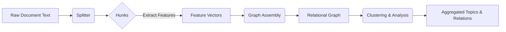

# Rich Relational Mapping in Split Text Hunks and Emitted Nodes

## Executive Summary  
This report examines methods to enrich the relational links between text segments (“hunks”) produced by a splitter and the graph nodes/messages generated by an emitter.  We first inventory the metadata currently output for each hunk (content, structural, grammatical, statistical fields, and semantic embeddings).  We then identify **intra-hunk** relations (within a segment) and **inter-hunk** relations (across segments) spanning semantics, syntax, discourse, coreference, topics, time, causality, rhetoric, embeddings, attention, graph structure, and pragmatic signals.  We propose a variety of **tunable controls** (thresholds, similarity metrics, window sizes, clustering parameters, attention sparsity, salience scores, etc.) to adjust splitting, grouping, and emission behavior.  Candidate **algorithms and architectures** include graph neural networks, hierarchical clustering, HMMs/CRFs, transformer modifications (e.g. attention biasing), topic models, spectral/community clustering, and dynamic graph models.  To evaluate these, we define metrics such as segmentation accuracy (WindowDiff【6†L1-L9】, precision/recall), clustering quality (purity, silhouette, NMI【10†L681-L690】), and performance (latency, memory).  We also recommend visualization tools (interactive graph viewers, mermaid diagrams, embedding scatterplots, timelines) and compare methods in a trade-off table.  Finally, we list key references (e.g. Hearst et al. on segmentation【6†L1-L9】, Blei et al. on LDA【24†L19-L27】, Nair et al. on neural CRFs【21†L270-L278】, RST discourse theory【27†L192-L200】) and outline a step-by-step prototyping plan with experiments.

## Hunk Metadata Inventory  
Before examining relations, note that each *hunk* from the current splitter carries rich metadata:
- **Verbatim (literal content):** The raw text (`content`) and an `origin_id`.  
- **Structural:** Hierarchy info such as `structural_path`, `parent_occurrence_id`, `prev_sibling_occurrence_id`, a `scope_stack`, a `heading_trail`, `document_position`, and `sibling_count`. These locate the hunk in the document tree.  
- **Grammatical:** Unit type and syntax metadata including `node_kind` and `layer_type`, as well as lists of `decorators`, `base_classes`, `import_context`, `scope_docstrings`, and cross-references.  
- **Statistical:** Token-level and context features: `token_count`, surrounding `context_window` text, the `split_reason` (why this break was made), `extraction_engine` name, and its confidence score.  
- **Semantic:** An embedding vector (currently often empty) would capture meaning-space information.  

These fields form the *vertices* of the emitter’s graph.  Rich relational mapping can leverage all of these dimensions.  

## Intra- and Inter-Hunk Relationship Types  
We categorize relations both *within* individual hunks and *between* different hunks. Possible types include:

- **Semantic Similarity (Topical/Conceptual):** Embedding or topic overlap between texts.  For example, two hunks about the same topic will have similar vector embeddings or overlapping latent topics (e.g. via LDA【24†L19-L27】).  Within a hunk, latent topic structure can reveal subtopic boundaries.  Between hunks, shared topics (high cosine similarity in embedding space) indicate semantic linkage.  
- **Syntactic Structure:** Within a hunk, the parse tree or part-of-speech patterns relate words (e.g. subject-verb-object). Across hunks, similarity of syntactic patterns or repeated grammatical constructions (e.g. parallel sentences) can signal coherence.  
- **Discourse and Rhetorical Relations:** Coherence relations like *elaboration*, *contrast*, *cause-effect*, etc.  (Rhetorical Structure Theory) hold between text spans【27†L192-L200】.  For example, one hunk may provide a *background* or *cause* for another.  Within a hunk, discourse markers (e.g. “however”, “because”) indicate local cohesion; between hunks, explicit cues (e.g. conjunctions at hunk boundaries) or inferred RST trees capture higher-level structure【27†L192-L200】.  
- **Coreference / Entity Linkage:** Entities mentioned in a hunk (via names, pronouns) may reappear in the same or other hunks.  Intra-hunk coreference ties pronouns to antecedents; inter-hunk coreference links the same entity across segments.  This may be discovered via named-entity recognition and coreference resolution.  
- **Topical Continuity:** Similar to semantic, this focuses on topics: latent topic models (LDA, HDP) assign topic distributions to each hunk【24†L19-L27】.  Overlap of topic distributions between hunks indicates topical continuity.  Intra-hunk, multiple topics might interweave (e.g. in long paragraphs).  
- **Temporal Relations:** If hunks describe events, their timestamps or verbal tense may imply a sequence (before/after).  Annotated corpora (e.g. TimeBank【31†L33-L42】) show that texts encode temporal relations.  We can extract temporal cues (dates, verb tense) to link hunks on a timeline.  
- **Causal Links:** One hunk may cause or justify another.  While formal causality extraction is hard, trigger words (“because”, “therefore”) and world knowledge can indicate causal inter-hunk edges.  (Causality overlaps discourse relations.)  
- **Latent Embedding Proximity:** Using neural embeddings of sentences or paragraphs, distance in latent space can define a graph relation (nearby nodes likely semantically related).  Transformers effectively treat text as a fully-connected graph of tokens【17†L135-L140】, and we can extend this to inter-hunk attention patterns.  
- **Attention Patterns:** If a transformer or attention model processes the whole document, the attention weights linking tokens across hunks reveal implicit relations.  For example, high attention from a word in hunk A to a word in hunk B suggests an inter-hunk dependency.  
- **Graph-based Relations:** We can build an explicit graph: nodes = hunks, edges = any of the above relations.  For instance, an edge for lexical overlap (shared key terms), an edge for hyperlink/reference, or a learned graph from a GNN.  Graph construction itself yields relational data (e.g. adjacency lists).  
- **Pragmatic/Intent Signals:** If the text is dialog or instructions, speech acts (question, assertion) or intent labels might connect hunks (e.g. question in hunk A answered in hunk B).  Pragmatic tagging or intent classifiers could reveal these edges.  
- **Metadata/Context Links:** Aside from content, external metadata ties can relate hunks: same document/time, author, or source, or temporal proximity (e.g. paragraphs written on same date).  These implicit context links are low-level but useful signals.

In summary, we should extract features capturing each of these relation types.  For example, we might compute: intra-hunk coreference chains; TF-IDF or embedding similarity; co-occurrence graphs of entities; dependency parses; discourse parse trees; topic vector overlaps【24†L19-L27】; temporal offsets【31†L33-L42】, etc.  

## Tunable Controls and Parameters  
To customize splitting and grouping, we propose a palette of “dials”:

- **Splitting Parameters:** Controls governing how text is broken into hunks.  Examples: *max token count* per hunk, *overlap ratio* between successive hunks (to preserve context), *split criteria* (e.g. break on paragraph, sentence boundary, or parse subtree).  Other knobs: whether to preserve whole sentences or paragraphs, or to force splits at rhetorical markers.  
- **Grouping and Clustering Controls:** Parameters for linking hunks into larger groups or topic clusters.  Examples: *similarity metric* (cosine on embeddings, Jaccard on term sets, KL-divergence on topic distributions), *similarity threshold* for grouping, *distance measures* (Euclidean, cosine, Manhattan, topic distance).  In hierarchical clustering: *linkage* (single, complete, average), *cluster count* or *cutoff height*.  Window sizes: how many adjacent hunks to consider together (sliding window).  Graph pruning: threshold on edge weight to drop weak relations.  
- **Emission/Extraction Controls:** Parameters that decide which nodes/messages to emit.  For example, *confidence threshold* on entity or relation extraction; *priority scoring* (emit only top-N salient nodes).  *Split reason weighting*: if certain relations (like cohesion drop) count as strong split triggers.  
- **Aggregation Controls:** Rules for merging smaller relations into larger ones.  For example, merging adjacent nodes if their *topic overlap* exceeds a threshold, or fusing segments by *parse tree continuity*.  We might allow *hierarchical aggregation* (first small groups, then merge into bigger topics).  
- **Similarity Metrics and Weightings:** We should allow plugging in different embedding models (word2vec, BERT, SBERT, custom encoder), or weighting schemes (TF-IDF vs. raw counts).  We can tune how much weight to give different features (e.g. lexical overlap vs. semantic vector distance vs. structural similarity).  
- **Attention/Transformer Controls:** In transformer-based processing, one could tune the *attention temperature* (sharpen/smooth distributions), *sparsity* (limit to k-nearest neighbors), or introduce attention bias terms to favor local vs. global context.   
- **Temporal Decay Factors:** If using sequence in time, decay older segments’ influence (e.g. exponential decay of similarity score as segments are farther apart chronologically).  
- **Caching and Context Window:** How much prior context to retain in a “sliding window” of hunks.  E.g. how many previous hunks to evaluate relations against (the GraphAssembler uses a window buffer).  This affects pairwise evaluations.  
- **Salience and Scoring Thresholds:** Assign salience scores to relations or nodes (e.g. TF-IDF importance, attention sum, or learned relevance).  Then threshold or rank-based pruning.  
- **Prune/Merge Heuristics:** For example, require a minimum support (number of shared entities) to create an inter-hunk edge, or allow merging of clusters only if internal coherence score improves.

Each control can be tuned experimentally to balance granularity and coherence.  We should treat them as hyperparameters in a system.

## Algorithms and Architectures  
We suggest a multi-pronged architecture combining classic and neural methods:

- **Graph Neural Networks (GNNs):** Model hunks (nodes) and their relations (edges) as a graph【15†L67-L75】.  A GNN can learn representations of nodes/edges by aggregating neighbor information.  For instance, one could build an initial graph with edges for lexical or topic similarity, and train a GNN to predict stronger connections or classifications (e.g. which clusters form).  Distill’s GNN intro emphasizes how graphs capture entity relations【15†L67-L75】 and how Transformer attention is akin to a fully-connected graph on text【17†L135-L140】.  We could use Graph Convolutional Networks or Graph Attention Networks to refine relational scores or to detect communities.  
- **Hierarchical Clustering:** Use agglomerative clustering on hunk feature vectors (TF-IDF, BERT embeddings, topic distributions) to form a hierarchy of topics.  By varying linkage (single/complete/average), we can control cluster shapes.  The clustering dendrogram itself can serve as a relation tree among hunks.  We may also merge clusters based on graph connectivity.  Clustering algorithms like HAC or divisive clustering can reveal multi-level structure.  
- **Hidden Markov Models (HMMs) and Pairwise Markov Chains:** Treat the sequence of hunks as observations in an HMM, where hidden states correspond to segment/topic boundaries.  Prior work has applied HMMs to text segmentation【37†L68-L77】.  A transition could model topic continuity, and emissions model the text features.  Pairwise Markov Models (a generalization) allow richer dependencies.  These probabilistic models yield learned relation sequences.  
- **Conditional Random Fields (CRFs):** Particularly, hierarchical CRFs are well-suited for segmenting and linking hierarchical structures.  For example, Nair et al. (2023) use a neural CRF to infer hierarchical segmentation, explicitly modeling dependencies between parent/child nodes【21†L270-L278】.  A CRF can enforce consistency between neighboring hunks or between levels of the hierarchy.  It can also integrate multiple feature types (topic, discourse cues) in a log-linear model.  
- **Transformer-based Attention Modifications:** Since Transformers already compute attention scores between tokens, we can adapt them for segment relations.  E.g. apply a hierarchical transformer that attends at the hunk level (each hunk as a token), or bias attention to emphasize semantically similar hunks.  Sparse attention (limiting to top-k relevant hunks) or multi-scale attention (mixing local and global windows) are options.  Techniques like Linformer, Performer, or encoder layers with custom cross-hunk attention can be explored.  
- **Topic Models:** Probabilistic topic models (LDA, HDP) assign topic vectors to each hunk【24†L19-L27】.  We can build a graph of hunks connecting those that share high-probability topics.  Newer topic embedding models (neural topic models) could provide soft semantic overlap.  LDA gives a hierarchical model (corpus→topics→words) which aligns with hierarchies of segments.  
- **Spectral Clustering:** Represent hunks as nodes in a similarity graph (based on embeddings or lexical overlap), then use spectral methods (eigen decomposition of Laplacian) to find clusters or partition the graph.  This is related to community detection but uses linear algebra to find cuts.  
- **Community Detection:** Algorithms like Louvain or Infomap can find densely connected groups of hunks in the graph【34†L260-L268】.  Louvain greedily maximizes modularity, identifying high-coherence clusters【34†L260-L268】.  This can reveal macro-topics or sections without pre-specifying number of groups.  
- **Dynamic Graph Models:** If document context evolves (e.g. time-ordered logs), dynamic graph approaches (temporal networks or sliding window graphs) can track how relations between hunks change over time.  One could use GraphLSTM or streaming community detection to adapt as new hunks arrive.  

Each method has trade-offs (discussed in the table).  In practice, a hybrid pipeline may combine them: e.g. use HMM/CRF to propose boundaries, then refine with GNN and clustering.  

## Metrics and Evaluation  
We recommend a mix of quantitative measures:

- **Segmentation Metrics:** For boundary detection, use precision/recall/F1 on predicted vs. gold breaks.  More robust: the Pk and WindowDiff metrics from Pevzner & Hearst【6†L1-L9】.  WindowDiff moves a fixed window and penalizes mismatches in boundary counts, better handling near-miss errors【6†L1-L9】.  (These assume we have reference segmentation or rhetorical structure trees.)  
- **Relation Detection Precision/Recall:** If we identify specific relations (e.g. coreference links, causal edges), measure how many predicted edges match annotated ones.  Build a gold graph of relations (if available) and compute precision/recall/F1 on edges.  
- **Clustering Quality:** For groupings of hunks, use clustering metrics: *Purity* (how single-topic each cluster is), *Normalized Mutual Information (NMI)*【10†L681-L690】, and *Silhouette score*.  Scikit-learn’s NMI yields 0–1 scores【10†L681-L690】.  Purity is simple (the fraction of items in each cluster from the dominant ground-truth class).  Silhouette measures cohesion vs separation.  These assume known labels or topics for hunks.  
- **Hierarchy Quality:** If building a hierarchy, one can use hierarchical clustering metrics or the hierarchical B-cubed / extended metrics from discourse parsing (like RST evaluation).  Lucien Carroll’s thesis suggests methods to evaluate hierarchical segmentations.  
- **Downstream Task Impact:** Measure how the relational graph affects downstream use.  For example, use these relations in a retrieval or summarization task and see if performance improves (e.g. mean reciprocal rank for QA, ROUGE for summarization).  This indirectly validates relation usefulness.  
- **Graph Statistics:** Track graph properties (average degree, connected components, modularity) to ensure the graph is well-formed.  Modularity is also an internal measure of community structure.  
- **Resource Metrics:** Evaluate computational cost: *latency per document*, *memory footprint*, and *throughput*.  Tune controls to meet performance needs.  
- **User Study/Ease-of-Use:** If applicable, have domain experts inspect the relations/graphs for interpretability and coverage.  

In all cases, we should vary one parameter at a time to see its effect (ablation study).  

## Visualization and Tooling  
Effective visualization aids understanding of relational structure:

- **Interactive Graph Viewers:** Tools like Gephi, Cytoscape or D3-based web apps can display the hunk-relation graph.  Nodes (hunks) can be labeled or colored by topic, size by token count, and edges by type (semantic, coref, etc.).  Users can zoom, filter by edge type/weight, and click to view hunk content.  
- **Mermaid Diagrams:** Use Mermaid to sketch flowcharts or hierarchies in documentation.  For example, a flow of the pipeline (`Splitter -> Hunks -> Relation Extractor -> Graph -> Emitter`) or a conceptual hierarchy tree.  MerMaid syntax allows quick prototyping of algorithm flows or data structures.  
- **Embedding Scatterplots:** Reduce high-dimensional embeddings of hunks to 2D (t-SNE, UMAP) and plot points colored by cluster or topic.  This visualizes semantic groupings.  Libraries like Plotly or TensorBoard Embedding Projector can be used.  
- **Timelines/Sequence Plots:** If temporal sequence matters, a timeline view (e.g. horizontal bars for hunks with time stamps) can overlay events, or a dependency timeline (like a Gantt chart) of relations.  
- **Dependency Trees and Dendrograms:** For hierarchical clustering, dendrogram charts show cluster merges.  For syntax, tree viewers (e.g. for constituent parses) can illustrate grammar relations.  
- **Dashboards/Notebooks:** A Jupyter or Streamlit dashboard combining charts (histograms of token counts, interactive sliders for parameters) enables tuning controls live.  
- **Mermaid Example:** Below is a mermaid flowchart sketch of one possible pipeline:

Such diagrams can clarify stages and help communicate the system design.  

## Methods and Controls Trade-offs  

| **Method/Control**        | **Accuracy** | **Compute Cost**  | **Interpretability** | **Latency** | **Ease of Tuning** |
|---------------------------|-------------:|------------------:|---------------------:|-----------:|-------------------:|
| **Graph Neural Net**      | High         | High             | Low                 | Medium      | Low (many hyperparams) |
| **Hierarchical Clustering**| Medium       | Low–Medium       | Medium              | Low         | Medium (linkage choice) |
| **HMM / Markov Chain**    | Medium       | Medium           | High                | Low–Medium  | Medium (states, transitions) |
| **CRF (Neural)**         | High         | Medium–High      | Medium              | Medium      | Low–Medium (feature design) |
| **Transformer Mods**     | High         | Very High        | Low                 | High        | Low (complex architecture) |
| **Topic Model (LDA)**    | Medium       | Medium           | Medium              | Low–Medium  | Medium (topic count) |
| **Spectral Clustering**  | Medium       | High             | Low                 | High        | Medium (graph construction) |
| **Community Detection**  | Medium       | Medium           | Medium              | Low–Medium  | Low (greedy heuristics) |
| **Threshold Controls**   | N/A          | N/A              | High (clear)        | Low         | High (tune threshold) |
| **Embedding Model Choice**| N/A         | Varies (GPU/CPU) | Medium (depends)    | Medium      | Medium (choose model) |

*Table: Comparison of candidate methods and controls by performance, cost, interpretability, latency, and tuning difficulty. “Accuracy” is qualitative (task-dependent). N/A means not applicable.*  

## Prioritized References for Further Study  
- **Hierarchical Segmentation & Evaluation:** Pevzner & Hearst (2002), *“A Critique and Improvement of an Evaluation Metric for Text Segmentation”* – introduces Pk and WindowDiff【6†L1-L9】.  
- **Topic Modeling:** Blei, Ng & Jordan (2003), *“Latent Dirichlet Allocation”* – foundational LDA for topic distributions in text【24†L19-L27】.  
- **Graph Neural Networks:** Sanchez-Lengeling et al. (2021) *“A Gentle Introduction to GNNs”* – conceptual overview of graph models【15†L67-L75】.  (Distill Pub)  
- **Discourse/Rhetoric:** Wikipedia RST article – overview of Rhetorical Structure Theory and relations (e.g. elaboration, cause)【27†L192-L200】.  
- **Hierarchical CRF Segmentation:** Nair et al. (2023), *“A Neural CRF-based Hierarchical Approach for Linear Text Segmentation”* – uses neural CRF for topic segmentation【21†L270-L278】.  
- **Text Segmentation:** Hearst (1997) *TextTiling* and successors for lexical cohesion (background context). Lucien Carroll (2010) “Evaluating Hierarchical Discourse Segmentation” (NAACL) for evaluation perspectives.  
- **Temporal Annotation:** Pustejovsky et al. (2003), *“The TimeBank Corpus”* – discusses richly annotated temporal relations【31†L33-L42】.  
- **Community Detection:** Blondel et al. (2008), *“Fast Unfolding of Communities in Large Networks”* – Louvain method (greedy modularity)【34†L260-L268】.  
- **Graph Visualization:** Resources on Cytoscape, D3.js (for dynamic graph UIs).  
- **Transformer Attention:** Research on sparse or global attention (e.g. “Longformer” or “BigBird” models) for alternative attention patterns.  
- **Embedding Techniques:** Documentation on Sentence Transformers or Transformer models (for computing hunk embeddings).  
- **Evaluation Metrics:** Scikit-learn docs on clustering metrics (NMI【10†L681-L690】), and ACL papers on coreference/semantic similarity benchmarks.  

These sources provide detailed algorithms, metrics, and case studies relevant to each component of the task.

## Prototyping Plan and Experiments  

1. **Data Preparation:** Collect representative documents and run the current splitter/emitter to obtain a corpus of HyperHunks with existing metadata. Optionally create a small annotated set (with known segment boundaries and relations).  
2. **Feature Extraction:** Implement pipelines to compute the listed relational features: e.g. parse trees for syntactic roles, named-entity coreference, topic distributions (via LDA), BERT sentence embeddings, temporal markers. Store these in a relational data structure (tables or graph DB).  
3. **Baseline Relations:** Start with simple heuristics: link adjacent hunks by cosine similarity in TF-IDF or embedding space, or by shared entities. Measure coherence (WindowDiff) against any ground truth.  
4. **Clustering & Graph Construction:** Apply clustering (hierarchical or spectral) to hunk vectors, vary thresholds. Build graph edges for high-confidence relations. Experiment with community detection (Louvain) on this graph. Evaluate cluster purity and segmentation accuracy.  
5. **Model-Based Approaches:** Train an HMM or CRF on annotated boundaries (if available). For GNN: construct an initial graph (nodes=huunks, edges=similarity), then apply a GCN/GraphSAGE to predict cluster membership or inter-node scores. For Transformer approach: fine-tune a model on hunk pairs to predict if they belong to same segment.  
6. **Tuning Controls:** Systematically vary each parameter (e.g. overlap ratio, similarity threshold, embedding dimension, attention sparsity) and record effects on metrics. Use grid search or Bayesian optimization on a validation set.  
7. **Evaluation:** Compute the defined metrics (segmentation Pk/WindowDiff, cluster NMI/silhouette, edge precision/recall). Analyze error cases (e.g. missed relations) and adjust methods.  
8. **Iteration:** Refine the feature set (e.g. add new cues like rhetorical markers), try alternate algorithms (e.g. switch from agglomerative to DBSCAN clustering), and compare.  
9. **Visualization & Feedback:** Build an interactive viewer to inspect output graphs and tune parameters manually. Use this to qualitatively verify that identified relations make sense.  

By following these steps, we can iteratively improve the mapping between hunks and nodes, leveraging both rules-based and learned methods. Each experiment should be documented with the chosen settings and resulting metrics.

**Sources:** The above recommendations draw on the cited literature (e.g., segmentation metrics【6†L1-L9】, topic models【24†L19-L27】, GNN principles【15†L67-L75】【17†L135-L140】, hierarchical CRFs【21†L270-L278】, discourse relations【27†L192-L200】, etc.) and general data science best practices. 

